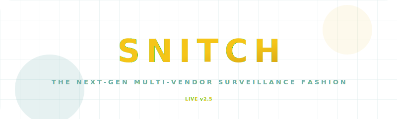
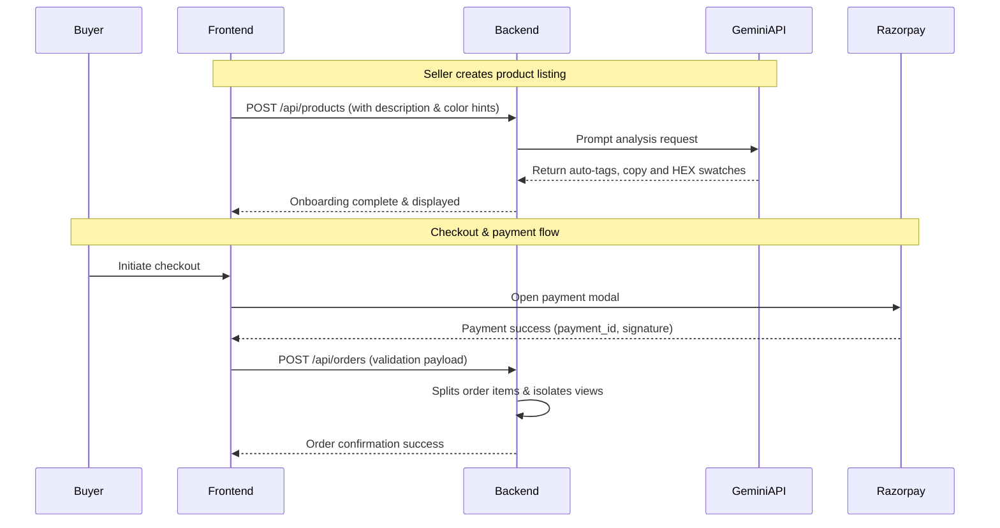

<!-- PREMIUM HEADER SVG -->
<p align="center">
  
</p>

---

<p align="center">
  <a href="#about-the-project">About</a> •
  <a href="#why-snitch-is-different-usps">Unique Highlights</a> •
  <a href="#tech-stack">Tech Stack</a> •
  <a href="#system-architecture">Architecture</a> •
  <a href="#installation--setup">Setup</a> •
  <a href="#production-deployment">Deployment</a>
</p>

---

## ✦ About the Project

**SNITCH** is a high-fashion, Gen-Z oriented, multi-tenant marketplace platform built from the ground up to redefine merchant operations and customer interactions. It bridges premium storefront experiences (glowing aesthetic layouts, cinematic loader animations, and high-fidelity transitions) with technical co-pilot assistance (powered by **Google Gemini**) and secure, isolated multi-tenant pipelines.

---

## 🚀 Why SNITCH is Different (USPs)

Unlike standard, generic templates or basic e-commerce apps, SNITCH features custom engines designed for high-performance and automated vendor onboarding:

### 1. **AI-Driven Merchant Co-Pilot & Swatch Generator**
* **Autonomous Swatch Mapping:** Sellers do not need to hunt for color codes. The platform integrates **Google Gemini API** to parse the product properties, determine the matching colors, and automatically generate CSS hex-code circles for buyers to click.
* **Gen-Z Copywriting Engine:** Instantly translates simple listing notes (e.g. *"pink t-shirt for summer"*) into engaging, high-converting product descriptions, tags, and titles customized for modern fashion buyers.

### 2. **Granular Multi-Vendor Order Fulfillment Isolation**
* **Consolidated Checkout, Isolated Tracking:** Buyers checkout once with a single unified Razorpay checkout, even when purchasing items from multiple independent vendors.
* **Double-Layer Backend Filters:** The database dynamically parses purchase items on the backend, partitioning order details so each vendor can view and update the fulfillment state of *only their own products*, preserving transaction integrity and privacy.

### 3. **Cinematic Web Experience**
* **Eased Physics Loader:** Uses custom `requestAnimationFrame` easing loops with GSAP to handle loading transitions smoothly, dodging React Strict Mode lifecycle double-mount interrupts.
* **Viewport-Calibrated Animators:** Leverages `ScrollTrigger` auto-refresh hooks to keep animations aligned, preventing DOM height shifts from freezing animations.

### 4. **Military-Grade Security Hardening**
* **14-Attack Vector Shield:** Fully integrates `helmet.js` to safeguard against critical threats, configuring strict Content Security Policies (CSP), frameguards (Clickjacking), noSniff parameters (MIME hijacking), HSTS protocols (SSL stripping), and Spectre memory protections.

---

## 💻 Tech Stack

### **Frontend**
<p align="left">
  
  
  
  
  
</p>

### **Backend**
<p align="left">
  
  
  
  
  
</p>

### **Third-Party APIs**
<p align="left">
  
  
</p>

---

## 🛠️ Installation & Setup

### **Prerequisites**
- Node.js (v18+)
- MongoDB connection string
- Google OAuth credentials (for login integration)
- Google Gemini API Key

---

### **1. Backend Configuration**

1. Clone the repository and navigate to the `Backend` directory:
   ```bash
   cd Backend
   ```
2. Install dependencies:
   ```bash
   npm install
   ```
3. Create a `.env` file in the `Backend` folder:
   ```env
   PORT=3000
   MONGO_URI=your_mongodb_connection_uri
   JWT_SECRET=your_jwt_signature_secret
   GOOGLE_CLIENT_ID=your_google_oauth_client_id
   GOOGLE_CLIENT_SECRET=your_google_oauth_client_secret
   GOOGLE_CALLBACK_URL=http://localhost:3000/api/auth/google/callback
   FRONTEND_URL=http://localhost:5173
   GEMINI_API_KEY=your_google_gemini_api_key
   RAZORPAY_KEY_ID=your_razorpay_key_id
   RAZORPAY_KEY_SECRET=your_razorpay_key_secret
   ```
4. Start the backend dev server:
   ```bash
   npm run dev
   ```

---

### **2. Frontend Configuration**

1. Navigate to the `Frontend` directory:
   ```bash
   cd ../Frontend
   ```
2. Install dependencies:
   ```bash
   npm install
   ```
3. Run the development environment:
   ```bash
   npm run dev
   ```
4. The application will be live at `http://localhost:5173`.

---

## 📐 System Architecture

### **Data Flows**


---

## 🔒 Security Policy
The server employs `helmet` to automatically assign HTTP headers protecting data frames:
```javascript
app.use(helmet({
    contentSecurityPolicy: { ... }, // Restricts inline scripts, assets, styles
    frameguard: { action: "sameorigin" }, // Blocks clickjacking
    hsts: { maxAge: 31536000, preload: true }, // Forces SSL
    crossOriginOpenerPolicy: { policy: "same-origin" }, // Sandbox memory leaks
    crossOriginResourcePolicy: { policy: "cross-origin" } // Allows microfrontends
}));
```

---

## 🚀 Production Deployment

To build and compile the frontend asset bundles for Render, Netlify, or Vercel:
```bash
# In the Frontend folder
npm run build
```
*Make sure to configure the production environment variables (`VITE_API_BASE_URL`) pointing to your live backend domain.*

---
<p align="center">
  Built with ✦ by Niladri & Teams
</p>
